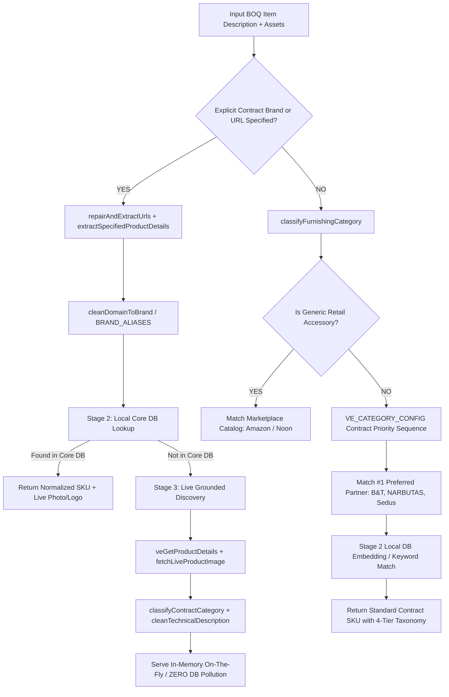

# 🤝 AGENT HANDOVER: VALUE-ENGINEERED AUTOMATCH & CATALOG ENGINE

> **Project**: BOQ - v2 (Salamony4all / BOQ Flow)  
> **Last Updated**: September 1, 2026  
> **Status**: 100% Operational & Verified across Branded Loose Furniture Schedules (68/68 rows extracted with specification images, cards, and auto-matches) & Unbranded BOQs. Core database pristine (22 core catalogs, zero disk pollution).

---

## 📌 1. Architecture Overview & Core Philosophy

The system uses a **unified 3-Stage Matching Architecture** for Value Engineered (VE) Offers and Auto-Matching, with distinct, optimized handling for **Branded** vs. **Non-Branded** BOQs.



---

## 🏢 2. Branded BOQ Pipeline (Technical Specifications & Links)

When a BOQ includes manufacturer names, product codes, finishes, sizes, or reference URLs (e.g. `02. SCHEDULE OF LOOSE FURNITURE.pdf`):

### Key Components:
1. **Multi-Code Card Header Resolution** ([`server/universalPatternParsersVercel.js`](file:///c:/Users/Salam/App/BOQ%20-%20v2/server/universalPatternParsersVercel.js#L1130-L1150)):
   * Resolves composite specification slide headers (e.g. `LF-001/ 002/ 004/ 005 – MODULAR BENCH`, `LF-019/ 022 – THEATER SEATS`, `LF-008 / 010 – ROUND FOLDABLE CHAIR`) by extracting all referenced codes (`LF-001`, `LF-002`, `LF-004`, `LF-005`, `LF-019`, `LF-022`) so that **100% of BOQ rows receive their specification card details and reference images in TableViewer**.
2. **2D Column Midpoint Partitioning** ([`server/universalPatternParsersVercel.js`](file:///c:/Users/Salam/App/BOQ%20-%20v2/server/universalPatternParsersVercel.js#L1120-L1135)):
   * `parseMaterialLayoutsV19` uses column midpoints (`midX = (headers[i-1].x + h.x) / 2`) to cleanly separate multi-card landscape slides without truncating field labels (`TYPE`, `SIZE`, `FINISH`, `SUPPLIER`).
3. **Line-Wrapped URL Repair & Extraction** ([`server/utils/veAutoDetectUtils.js`](file:///c:/Users/Salam/App/BOQ%20-%20v2/server/utils/veAutoDetectUtils.js#L210-L260)):
   * `repairAndExtractUrls(text)` automatically re-assembles broken URLs split across lines or hyphens by PDF extractors (e.g., `executive- desk#/22-dimensions...` ➔ `https://workspace.ae/executive-desks/ava-series-rectangular-executive-desk`), resolving previous 500 errors on clicked reference links.
4. **Specified Details Extraction** ([`server/utils/veAutoDetectUtils.js`](file:///c:/Users/Salam/App/BOQ%20-%20v2/server/utils/veAutoDetectUtils.js#L270-L380)):
   * `extractSpecifiedProductDetails(text)` parses consolidated specifications:
     * **Brand**: Normalized from domain or text (e.g. `moodie.com.au` ➔ `Moonako`, `timeoutspace.com` ➔ `TON`, `workspace.ae` ➔ `Workspace.ae`, `amazon.com` ➔ `Amazon`, `planurban.it` ➔ `Planurban`, `westelm.com` ➔ `West Elm`).
     * **Model**: Extracted via high-precision keyword patterns (`Lobby`, `Arco`, `Limone`, `Scala 148`, `Mesa Cuvier`, `Stella`, `Halo Modern`, `Piper`, `Skill`, `Pila`, `P.O.V.`, `Satellite`, `Minglez Cart`, `Sew Ready Table`, `Enterprise Desk`, `Cobra Armchair`).
     * **Specs**: Dimensions (`Size`), finishes (`Finish`), item type (`Type`), and clean product URLs.
5. **Canonical Brand Resolver & Alias Dict** ([`server/server.js`](file:///c:/Users/Salam/App/BOQ%20-%20v2/server/server.js#L3182-L3240)):
   * Strictly prioritizes `BRAND_ALIASES` so aliases like `moodie` map 100% reliably to `Moonako`.
   * Rejects non-brand words and model-as-brand hallucinations (`NON_BRAND_MODEL_WORDS`).
6. **Pristine Core Database (Zero Disk Pollution)**:
   * Only the **22 pristine core contract brand JSON files** remain on disk and in Supabase.
   * New on-the-fly discovered products are served directly **in-memory** for the user's active offer without generating messy test `.json` files or modifying the local database.

---

## 🛡️ 3. Bidirectional Brand Safety & Category Guardrails

The matching engine enforces **strict dual-direction guardrails** to prevent commercial items from ever matching to retail marketplaces and vice-versa:

### 1. Commercial Contract Items CANNOT Match to Amazon/Retail Marketplaces
- **Commercial Interceptor (`isCommercialFurniture`)**:
  Any item identified as commercial furniture (`desks`, `workstations`, `executive task chairs`, `sofas`, `lounges`, `credenzas`, `filing cabinets`, `acoustic pods`, `boardroom tables`) without an explicit consumer marketplace link **strictly forbids Amazon/Noon/Home Depot** from being assigned.
- **Contract Priority Sequences**:
  - `desking` ➔ `NARBUTAS`, `Nurus`, `Ottimo Furniture`, `FREZZA`, `LAS`, `Ofifran`
  - `taskSeating` ➔ `Sedus Stoll`, `NARBUTAS`, `Sokoa`, `Rim`, `Dauphin`
  - `softSeating` ➔ `B&T Design`, `Arper`, `AMARA`, `FREZZA`
  - `storage` ➔ `NARBUTAS`, `Nurus`, `Ottimo Furniture`, `LAS`

### 2. Retail Generic Accessories CANNOT Hijack Commercial Brands
- Minor non-furniture accessories (e.g. `power strips`, `cable grommets`, `monitor arms`, `mobile food/craft carts`, `desk lamps`, `cushions`, `waste bins`) or items with explicit `amazon.com` / `homedepot.com` URLs route to `genericAccessories` and resolve to consumer marketplace catalogs.
- Contract manufacturer links (`bt.design`, `workspace.ae`, `narbutas.com`, `sedus.com`, `ton.eu`) short-circuit directly to verified contract manufacturers.

---

## ⚡ 4. Frontend AI Auto-Match Modal & UX (`AISemanticMatchModal.jsx`)

1. **Instant Non-Blocking Modal Launch**:
   - Clicking `✨` opens the modal immediately with a glowing AI orb and 3-stage animated progress indicators (`Decomposing specifications` ➔ `Scanning catalogs` ➔ `Matching photos & unit rates`).
2. **Sub-Second Primary Resolution**:
   - Primary exact match resolves via `/api/ve-match-auto` in **< 150ms**, while partner catalog alternatives load concurrently in the background.
3. **Multi-Image Cell Viewer in TableViewer**:
   - Multi-image gallery cells are enlarged to prevent accidental image deletions on large table views.

---

## 🌳 5. Standard 4-Tier Contract Taxonomy Reference

Every product (whether matched from local DB or discovered live) is normalized to this 4-tier taxonomy via [`classifyContractCategory`](file:///c:/Users/Salam/App/BOQ%20-%20v2/server/utils/brandLogos.js#L106-L205):

| Main Category | Priority Sub-Categories | Typical Matches |
| :--- | :--- | :--- |
| **Office Seating** | `Task Chairs`, `Staff Chairs`, `Executive Chairs`, `Conference Chairs`, `Training Chairs`, `Lounge Chairs`, `Sofas`, `Stools`, `Specialist Chairs` | Task mesh chairs, executive high-back, folding chairs (Piper, Pila), lounge armchairs (Stella), modular benches (Lobby, Halo), auditorium tip-up seats (Scala 148) |
| **Desk & Table** | `Single Desks`, `Desk System`, `Height Adjustable Desks`, `Conference Tables`, `Meeting Tables`, `Coffee Tables`, `Dining Tables`, `Lounge Tables`, `Reception Desks` | Executive desks, bench workstations, folding conference tables (Skill), dining tables (Mesa Cuvier), round coffee tables (Satellite, Sini) |
| **Storage** | `cabinets`, `pedestals`, `lateral files`, `credenzas`, `wardrobes`, `bookcase`, `Storage` | High filing cabinets, mobile pedestals, credenzas, lockers |
| **Furniture** | `Planters`, `Benches`, `Screens`, `Accessories`, `Pods`, `Outdoor` | Modular planters (Limone), landscape seating, partition screens |
| **Acoustic Solutions** | `Office Pods`, `Acoustic Panels` | Soundproof phone booths (Framery), acoustic meeting rooms, wall baffles |
| **Accessories** | `wires managerment`, `General Accessories`, `Utility Carts` | Cable grommets, monitor arms, power rails, mobile food/vendor carts |

---

## 🧪 6. Testing & Diagnostic Cheatsheet

### 1. Test Loose Furniture Schedule (68-Row Complete Verification):
```bash
node server/scripts/test_all_schedule_items.js
```

### 2. Test Bidirectional Safety Verification:
```bash
node -e "const testCases = [ { name: 'Generic Office Desk', desc: 'Executive Desk 1800x900', expectNot: 'Amazon' }, { name: 'Generic Task Chair', desc: 'Ergonomic Task Chair High Mesh Back', expectNot: 'Amazon' }, { name: 'Specified Workspace.ae Desk', desc: 'Office Desk | https://workspace.ae/executive-desks/ava-series-rectangular-executive-desk', expectBrand: 'Workspace.ae' }, { name: 'Generic Power Strip', desc: '4-socket power strip with USB ports', expectBrand: 'Amazon' } ]; (async () => { for (const tc of testCases) { const res = await fetch('http://localhost:3001/api/ve-match-auto', { method: 'POST', headers: {'Content-Type': 'application/json'}, body: JSON.stringify({ description: tc.desc }) }); const data = await res.json(); console.log(tc.name, '➔', data.product?.brand, '(', data.product?.model, ')'); } })();"
```

### 3. Clean Temporary Files & Supabase Sync:
```bash
node server/scripts/clean_temp_brands.js; node server/scripts/sync_clean_supabase_brands.js
```

### 4. Running Backend Server Daemon:
```bash
node server/server.js
```
*(Runs on port 3001 with active proxy and Supabase sync).*
