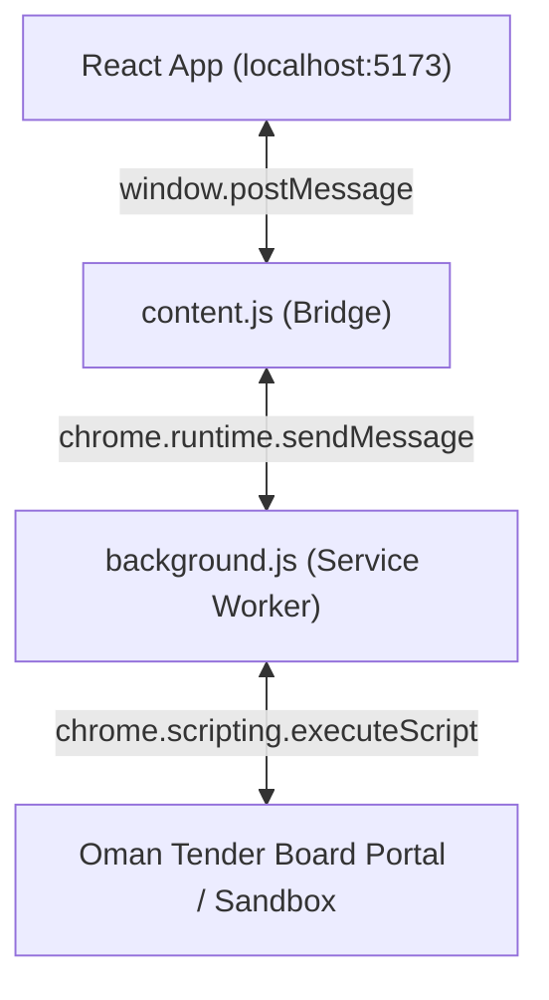

# Technical Guide: Direct Client-Side Browser Control via Chrome Extension

This guide outlines the architecture, setup instructions, and execution workflows for the direct client-side Chrome Extension browser control built for the BOQ application.

---

## 1. System Architecture

### Unified Automation Pipeline
Both the **React Modal UI** and the **Chrome Extension Popover** run the exact same unified execution pipeline:

1. **State Syncer (React -> Extension)**:
   * When the Autofill Modal opens, it automatically syncs active API keys, selected models (`gemma-4-31b-it`), and active tier preferences to `chrome.storage.local`.
   * When a platform is mapped or loaded, the modal syncs the blueprint to the extension.
2. **Execute Bulk Fill (Autonomous Mapping & Exec)**:
   * Checks if a blueprint exists for the active domain.
   * If missing, it extracts the DOM structure of the active portal tab, sends a POST request to `/api/tender/map-platform` (using the synced API key and model headers), parses the new selectors via AI, saves the blueprint to **Supabase**, and stores it locally.
   * Runs the bulk script injection to fill the page.

---

## 2. Completed Features

### 🔌 Real-Time Log Console
* Bypassed the empty VNC window inside `TenderAutofillModal.jsx`.
* Replaced it with a high-fidelity scroll-locked terminal log console showing color-coded actions (e.g. `✏️` for fills, `✅` for success, `🛑` for errors, `⚠️` for warnings) directly in the web app UI.

### 🏷️ Smart Global Field Finder
* Bypassed naive CSS selector matching (`document.querySelector`).
* Implemented a multi-stage search strategy inside the fill script injection:
  1. Tries the label as a direct CSS selector.
  2. Searches `<label>` elements containing the string case-insensitively, automatically tracing linked `for` IDs, nested inputs, or adjacent sibling input containers.
  3. Searches all input `name`, `id`, or `placeholder` attributes matching the column name.

### 🔐 Persistent State & Worker Recovery
* Serves worker connection stability across Manifest V3 service worker lifecycle sleeps by loading `automationTabId` from storage upon worker wakes.
* Automatically syncs blueprints, BOQ datasets, and active AI settings on modal openings.

---

## 3. Quick Installation & Setup

1. Locate the packaged zip file: [public/extension.zip](file:///C:/Users/Mohamad60025/Desktop/App/BOQ - v2/public/extension.zip) or the source folder [extension/](file:///C:/Users/Mohamad60025/Desktop/App/BOQ - v2/extension).
2. Open Google Chrome and navigate to `chrome://extensions/`.
3. Toggle **Developer mode** to **ON** (top-right).
4. Click **Load unpacked** (top-left) and select the extracted `extension/` folder.
5. In your React app modal, toggle **Use Chrome Extension** to **ON** to redirect all operations directly through the browser.
