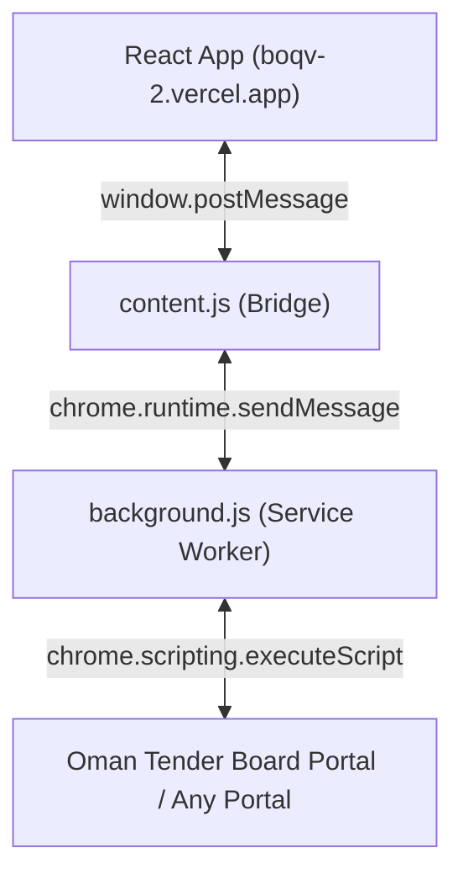

# Chrome Extension Autofill — Feature Guide

The BOQ Chrome Extension replaces the remote Railway browser session with **direct client-side browser control**, running entirely inside the user's own Chrome without a VNC stream or remote container.

---

## 1. Architecture



**Message flow:**
1. React modal sends commands via `window.postMessage` → content script picks them up.
2. Content script forwards to the background service worker via `chrome.runtime.sendMessage`.
3. Service worker executes scripts directly in the portal tab via `chrome.scripting.executeScript`.
4. Logs stream back in real time to the React log console.

---

## 2. Unified Execution Pipeline

Both the **React Modal** and the **Extension Popup** run the identical pipeline:

| Step | What happens |
|---|---|
| **State Sync** | Modal opens → API keys, active model, and tier preferences sync to `chrome.storage.local` |
| **Blueprint Check** | Checks if a DOM selector blueprint exists for the active portal domain |
| **AI Mapping** | If no blueprint → extracts portal DOM → calls `POST /api/tender/map-platform` → AI extracts CSS selectors → saved to Supabase `portal_blueprints` table |
| **Bulk Fill** | Script injected into portal tab → fills all rows using saved selectors |
| **Live Logs** | Color-coded log console: `✏️` fill, `✅` success, `🛑` error, `⚠️` warning |

---

## 3. Key Features

### 🖥️ Real-Time Log Console
The VNC iframe is replaced by a scroll-locked terminal log panel embedded directly inside `TenderAutofillModal.jsx`. All fill actions, errors, and warnings stream live.

### 🏷️ Smart Global Field Finder
Multi-stage field search inside the injected fill script:
1. Try label as a direct CSS selector.
2. Search `<label>` elements by text (case-insensitive) → trace `for` ID, nested inputs, or adjacent siblings.
3. Search all inputs by `name`, `id`, or `placeholder` attribute matching the column name.

### 🔐 Persistent State & Worker Recovery
- Service worker restores `automationTabId` and `reactTabId` from `chrome.storage.local` on wake-up (Manifest V3 lifecycle safe).
- Blueprints, BOQ datasets, and AI settings auto-sync every time the modal opens.

---

## 4. Extension Files

| File | Role |
|---|---|
| `extension/manifest.json` | MV3 manifest. Declares permissions: `tabs`, `scripting`, `activeTab`, `storage`. Host permissions cover `boqv-2.vercel.app` and `localhost:*`. |
| `extension/content.js` | Bridge script injected into every matched page. Relays `postMessage` ↔ `chrome.runtime` messages. |
| `extension/background.js` | Service worker. Manages portal tab, executes fill scripts, streams logs back to React. |
| `extension/popup.html/js` | Extension popover. Mirrors the React modal controls (map, execute, status). |
| `extension/favicon.png` | Extension icon (16×16, 32×32, 48×48, 128×128). |

---

## 5. Installation

### Option A — Download from Live App (Recommended)
1. Open **[boqv-2.vercel.app](https://boqv-2.vercel.app)**.
2. Open the **Tender Autofill** modal → click **Install Extension (Download ZIP)**.
3. Unzip the downloaded `extension.zip`.
4. In Chrome, go to `chrome://extensions/` → enable **Developer mode** → click **Load unpacked** → select the unzipped folder.
5. Toggle **Use Chrome Extension** to **ON** in the modal.

### Option B — Load from source
1. Open Chrome → `chrome://extensions/` → enable **Developer mode**.
2. Click **Load unpacked** → select the `extension/` folder from this repo.
3. Toggle **Use Chrome Extension** to **ON** in the modal.

---

## 6. Vercel Deployment Notes

- `extension.zip` is served from `public/extension.zip` as a static asset.
- `vercel.json` includes an explicit `/extension.zip` route and `Content-Disposition: attachment` header so browsers download the file directly instead of navigating to it.
- The extension's `host_permissions` include `https://*.vercel.app/*` so the content script can communicate with the live Vercel frontend.
- API calls from the extension use the same dynamic `apiBase` as the React app — no hardcoded localhost URLs.

---

## 7. Packaging (Update extension.zip)

Run from the project root whenever extension source files change:

```powershell
# PowerShell
Compress-Archive -Path extension\* -DestinationPath public\extension.zip -Force
```

Then commit and push — Vercel redeploys automatically.
